# zOS-Connect
This Journey describes the steps to try out the z/OS Connect Enterprise Edition trials.

## Overview
IBM® z/OS® Connect Enterprise Edition is a framework that enables z/OS based programs and data to participate fully in the new API economy for mobile and cloud applications.

IBM z/OS Connect Enterprise Edition V2.0 provides access to z/OS subsystems, such as CICS®, IMS™, WebSphere® MQ, DB2®, and Batch, that use RESTful APIs with JSON formatted messages. The framework provides concurrent access, through a common interface, to multiple z/OS subsystems.

z/OS Connect EE can help to deliver benefits for an enterprise in two ways.
* It provides an intuitive workstation-based tool, the z/OS Connect EE API Editor, that enables a developer, with or without z/OS skills, to create RESTful APIs from traditional z/OS based assets. The core business assets that run on z/OS can easily be adapted to the latest mobile and cloud communication techniques and message protocol formats.
* Mobile and cloud application developers, inside or outside the enterprise, can incorporate z/OS data and transactions into their applications without the need to understand z/OS subsystems. The z/OS resources appear as any other RESTful API. 

## Included components
[IBM® z/OS® Connect Enterprise Edition](https://www.ibm.com/us-en/marketplace/connect-enterprise-edition)    
[IBM® CICS®](https://www-01.ibm.com/software/data/enterprise-application-servers/cics/)    
IBM® IMS® ???   

## Prerequisites

To request a trial, go to [IBM Trial homepage](https://www-03.ibm.com/systems/z/resources/trials.html). On this page, navigate to the **z/OS Connect Enterprise Edition** panel on the right. In the panel, click **"register now"** button and follow the steps. If everything goes through, you shoud see a screen titled "Congradulations, your environment is on its way".
Wait for an email notification from "zTrial".
The waiting normally lasts several hours to one business day.   
The trial is available through a Windows-based remote desktop environment.

In order to access the trial environment, you must be able to connect to a remote system over a network connection.
Windows users should use the built-in Remote Desktop Connection application.       
Mac users should use the Remote Desktop app, available from the App Store.       
Linux users have several choices of remote desktop application, which might vary between distribution.   

## Expose a CICS COBOL program as a RESTful API.

IBM® z/OS Connect Enterprise Edition (z/OS Connect EE) makes exposing a CICS® application through a RESTful API quick and easy.

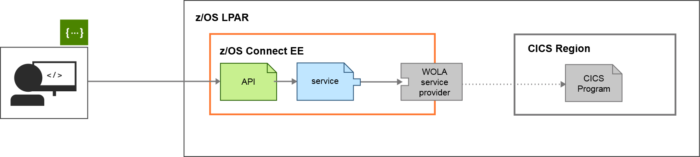

This scenario guides you through the steps in roughly 30 minutes. By the end of the session, you'll know how to:

*   Create and deploy an API from within IBM Developer for z Systems™.
*   Associate and map an API to a service representation of a CICS application, no code required.
*   Test an API by using the built-in Swagger UI.

No previous knowledge of CICS, z/OS Connect EE, or API design is needed, but some awareness of API terminology might help.

Please wait a moment while your development environment loads (this takes about 20 seconds). 

1.  [Creating the API Project](#create_api_project)  
    Create an API project that will contain your API and service mapping.
2.  [Creating the API](#create_api)  
    Create a basic API that uses RESTful principles.
3.  [Associating a service with the API](#associate_service_with_api)  
    Associate your API to a Service Archive file.
4.  [Mapping the request](#map_request)  
    Map your API parameters to fields in the associated service.
5.  [Mapping the response](#map_response)  
    Remove irrelevant values from the response so that your API returns relevant fields only.
6.  [Deploying the API](#deploy_api)  
    Package and deploy your API from within the API Editor.
7.  [Testing the API](#test_api)  
    Test your API by using the built-in Swagger UI.

### Creating the API Project  

Create an API project that will contain your API and service mapping.

Before you create your API, you must create a new API project. A z/OS® Connect EE API Project contains files that represent the API, and the mappings from the API to the services.

Note: You will connect to a CICS® application that holds inventory information about office stationary (for example, price and stock levels), so let's call our project <kbd class="ph userinput">catalog</kbd>.

1.  On the development environment menu bar, click File > New > Project... to open the New Project wizard.
2.  Expand the z/OS Connect Enterprise Edition folder, select z/OS Connect EE API Project, and click Next.
3.  Complete the fields as follows:

    *   type <kbd class="ph userinput">catalog</kbd> in the Project name and API name fields.
    *   type <kbd class="ph userinput">/catalogManager</kbd> in the Base path field.    

 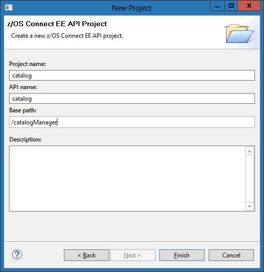  

4.  Click Finish to create the project in the Project Explorer.

    
The z/OS Connect EE API Editor dialog opens.

<section class="section result">Your API project is created.</section>

<section class="section postreq">The next step is to create your API: let's do that now.</section>

### Creating the API 

Create a basic API that uses RESTful principles.

<section class="section context">You'll create an API that a consumer can use to query the stationery catalog. The API will connect through a service to the COBOL application in CICS®.</section>

1.  In the Path field, replace `/newPath1` with the value <kbd class="ph userinput">/items/{itemID}</kbd>.

    
The parameter `{itemID}` is a placeholder that represents the value that is provided by an API consumer when they make a request.

    For example, the item `24-pack of black ball pens` has an ID of `10`, so you would specify <kbd class="ph userinput">/items/10</kbd> in your API request.

    

2.  Remove the POST, PUT, and DELETE methods for this path by clicking the X icon associated with each method.

This leaves the GET method. The GET method is typically used for retrieving data, which is the purpose of your API.       
  

3.  Click File > Save from the menu to save your progress.

<section class="section result">You've created the front end of your API! You must now connect the API to the application in CICS. In z/OS Connect EE, this connection is through a service, which represents the logic of the CICS application in a more consumable form.</section>

<section class="section postreq">Next, you'll associate your API with that relevant service.</section>

### Associating a service with the API 

Associate your API to a Service Archive file.

In z/OS Connect EE, a service archive file (`.sar` file) represents the underlying z/OS® asset.

z/OS Connect EE provides tooling to generate `.sar` files for its compatible subsystems (including CICS®, IMS™, DB2®, and IBM® MQ).

In this scenario, the `.sar` file is already generated, so you can focus on creating, deploying, and testing your API.

1.  Click Service....

    
The Select a z/OS Connect EE Service dialog box opens.

2.  Click File System.
3.  Browse to `C:/Service Archive Files`.
4.  Select the `inquireSingle.sar` file and click Open.
5.  In the dialog box that opens, click OK to confirm the import.
6.  Click OK.

The `inquireSingle` service is now associated with the get method of your API.     
  

7.  Click File > Save from the menu to save your progress.

<section class="section result">Great, the GET method of your API is now configured to connect to the CICS application through the `inquireSingle` service.</section>

In this scenario, the connection between z/OS Connect EE and CICS is configured for you (using the WOLA service provider).

The final step is to configure the mappings between your new API and the `inquireSingle` service, which represents the CICS COBOL application logic.

### Mapping the request 

Map your API parameters to fields in the associated service.

<section class="section context">Use the request mapping to associate parameters in your API with fields in the `inquireSingle` service, and to remove redundant fields from the API documentation.</section>

1.  Next to the GET method, click Mapping... then click Open Request Mapping.

    
The request tab opens.

2.  Right-click `ca_request_id`, then click Add Assign transform.

    
A static value is assigned to the field in the request schema.

3.  In the Properties view, at the bottom of the window, click General and set Value to <kbd class="ph userinput">01INQS</kbd>.

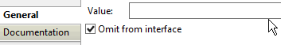

Leave the Omit from interface option checked to exclude this value from the API documentation.

4.  Expand the field `ca_inquire_single` so that the sub-field `ca_single_item` is visible.
5.  Select the fields `ca_return_code`, `ca_response_message`, and `ca_single_item`.

    
Press Ctrl and click to select multiple fields.

6.  Right-click one of the selected fields, then click Add Remove transform.

    
The fields are now removed from the API documentation.

7.  Connect the path parameter itemID to the field `ca_item_ref_req` by clicking and dragging one to the other.

    A Move action is created that assigns the path parameter `itemID` in the HTTP request to the field `ca_item_ref_req` in the service's JSON content.

    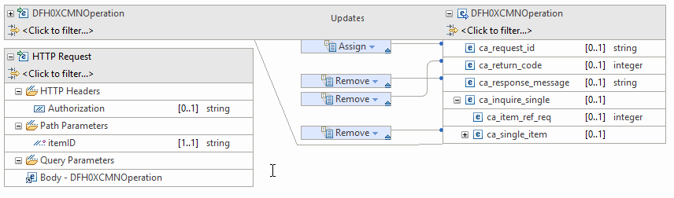  

    
Note: This mapping defines the flow of a value, which is passed in by an API consumer, to the service associated with the API. The service then passes the value to the CICS application. At each stage, the data is transformed into formats and structures that each participant can understand.

8.  Click File > Save from the menu to save your progress.
9.  Close the request tab.

<section class="section postreq">The next step is to clean up the API response by removing fields that are not related to the API request.</section>

### Mapping the response 

Remove irrelevant values from the response so that your API returns relevant fields only.

<section class="section context">The API you're creating is designed to pass back information about a requested item in the catalog application. However, the service `inquireSingle` contain several fields that aren’t relevant to that request.

You can safely remove these fields to make the API response and the API documentation clearer.

</section>

1.  Click Mapping... for the GET method, then click Open Response Mapping.
2.  Expand the field `ca_inquire_single` so that the sub-field `ca_item_ref_req` is visible.
3.  On the right side of the window, select the `ca_request_id` and `ca_item_ref_req` fields.

    
Press Ctrl and click to select multiple fields.

4.  Right-click one of the selected fields, and select Add Remove transform.

This excludes these fields from the body of the response.  
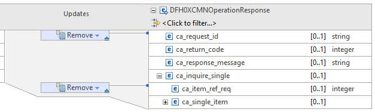  

5.  Click File > Save from the menu to save your progress.
6.  Close the response tab.

<section class="section result">You completed the request and response mappings.</section>

<section class="section postreq">You completed your API front end, your service association, and respective API-to-service mappings, so go ahead and make this API available.</section>

### Deploying the API 

Package and deploy your API from within the API Editor.

<section class="section context">Deploying your API is a quick, simple process that you can complete without leaving the developer environment.</section>

1.  In the Project Explorer view, select your API project (catalog) and right-click to select z/OS Connect EE > Deploy API to z/OS Connect EE Server.
2.  Click OK.

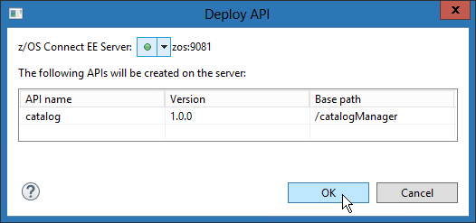Your API is being deployed.

3.  When deployment completes, click OK on the Result dialog box.

    
Your API is now successfully deployed!

<section class="section result">Creating and deploying this API using z/OS Connect EE gives your API consumers an easy, programmable way to interact with a CICS® application without having to work with unfamiliar data structures, or understand CICS.</section>

<section class="section postreq">You can test your work now, by calling the API from within the development environment by using the built-in interactive API documentation.</section>

### Testing the API 

Test your API by using the built-in Swagger UI.

<section class="section context">The OpenAPI (previously Swagger) specification is one of the most popular frameworks for documenting APIs. Any API that you create by using the z/OS Connect EE API Editor is automatically OpenAPI 2.0 compliant.

You can use the built-in Swagger UI to test out an API from within the developer environment. Let's try that now by opening up the Swagger UI for your new API, and request information about an item in the catalog.

</section>

1.  In the z/OS Connect EE Servers view, expand the API folder, right-click your API, and click Open in Swagger UI.

    
The Swagger UI for your API opens.

2.  In the tab that opens, click default, and then /items/{itemID}

    
Take a look at the Example Value JSON. You'll notice that the fields that you removed as part of the mapping are not present.

The CICS application that you have exposed by creating this API contains an inventory of office stationary. A 24-pack of black ball pens has an `itemID` of <kbd class="ph userinput">10</kbd>.

You can use your new API to check the price and stock levels of this item.

1.  Type the value <kbd class="ph userinput">10</kbd> in the relevant text box, then click Try it out.

    
Scroll down to see the response. By inspecting the Response Body, you can see that this item costs $2.90 and 129 items are in stock.

         {
                                "DFH0XCMNOperationResponse": { "ca_return_code": 0, "ca_response_message":
                                "RETURNED ITEM: REF =0010", "ca_inquire_single": { "ca_single_item": {
                                    "in_sngl_stock": 129, "ca_sngl_description": "Ball Pens Black
                                24pk", "ca_sngl_item_ref": 10, "on_sngl_order": 0, "ca_sngl_cost":
                                    "002.90", "ca_sngl_department": 10 } } } } 

    

Congratulations! You've successfully exposed a CICS® application as a RESTful API by using z/OS C

## Expose an IMS application as a RESTful API

IBM® z/OS Connect Enterprise Edition (z/OS Connect EE) makes exposing an IMS™ application through a RESTful API quick and easy.

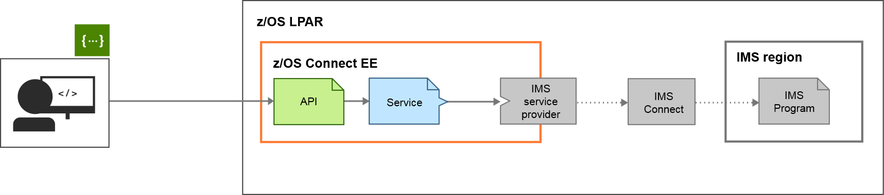

This scenario guides you through the steps in roughly 30 minutes. By the end of the session, you'll know how to:

*   Create and deploy an API from within IBM Developer for z Systems™.
*   Associate and map an API to a service representation of a CICS application, no code required.
*   Test an API by using the built-in Swagger UI.

No previous knowledge of IMS, z/OS Connect EE, or API design is needed, but some awareness of API terminology might help.

Please wait a moment while your development environment loads (this takes about 20 seconds). 

1.  [Creating the API Project](#createapi_project)  
    Create an API project that will contain your API and service mapping.
2.  [Creating the API](#createapi)  
    Create a basic API that uses RESTful principles.
3.  [Associating a service with the API](#associateservice_with_api)  
    Associate your API to a Service Archive file.
4.  [Mapping the request](#maprequest)  
    Map your API parameters to fields in the associated service.
5.  [Mapping the response](#mapresponse)  
    Remove irrelevant values from the response so that your API returns relevant fields only.
6.  [Deploying the API](#deployapi)  
    Package and deploy your API from within the API Editor.
7.  [Testing the API](#testapi)  
    Test your API by using the built-in Swagger UI.

### Creating the API Project 

Create an API project that will contain your API and service mapping.

Before you create your API, you must create a new API project. A z/OS® Connect EE API Project contains files that represent the API, and the mappings from the API to the services.

Note: You will connect to an IMS™ application that holds contact information, so let's call our project <kbd class="ph userinput">phonebook</kbd>.

</section>

1.  On the development environment menu bar, click File > New > Project... to open the New Project wizard.
2.  Expand the z/OS Connect Enterprise Edition folder, select z/OS Connect EE API Project, and click Next.
3.  Complete the fields as follows:

    

    *   enter <kbd class="ph userinput">phoneBook</kbd> in the Project name field and API name field.
    *   enter <kbd class="ph userinput">/phoneBook</kbd> in the Base path field.

    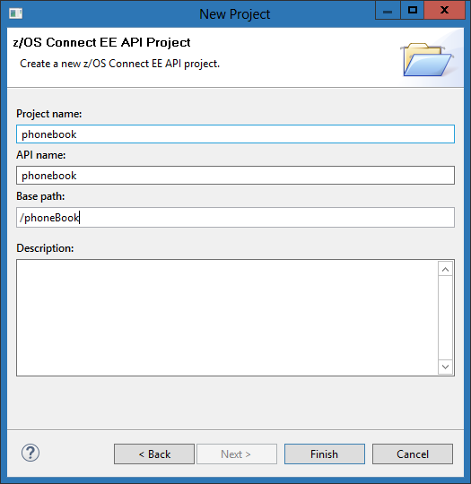  
    

4.  Click Finish to create the project in the Project Explorer.

    
The z/OS Connect EE API Editor dialog opens.

<section class="section result">Your API project is created.</section>

<section class="section postreq">The next step is to create your API: let's do that now.</section>

### Creating the API 

Create a basic API that uses RESTful principles.

You'll create an API that a consumer can use to add contact information to the phone book program. The API will connect through a service to the program in IMS™.

1.  In the Path field, replace /newPath1 with the value /contacts.

    
The contact record values are sent in the HTTP message body of our POST request. In this case, no parameters are stored in the URL.

2.  Remove the GET, PUT and DELETE methods for this path by clicking on the X icon associated with each method.

This leaves the POST method. The POST method is typically used for submitting data, which is the purpose of your API.  
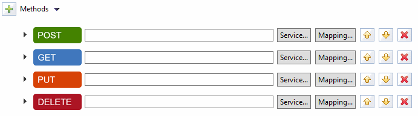  

3.  Click File > Save from the menu to save your progress.

<section class="section result">You've created the front end of your API! You must now connect the API to the program in IMS. In z/OS Connect EE, this connection is through a service, which represents the logic of the IMS program in a more consumable form.</section>

<section class="section postreq">Next, you'll associate your API with that relevant service.</section>

### Associating a service with the API 

Associate your API to a Service Archive file.

In z/OS Connect EE, a service archive file (`.sar` file) represents the underlying z/OS® asset.

z/OS Connect EE provides tooling to generate `.sar` files for its compatible subsystems (including CICS®, IMS™, DB2®, and IBM® MQ).

In this scenario, the `.sar` file is already generated, so you can focus on creating, deploying, and testing your API.

1.  Click Service....

    
The Select a z/OS Connect EE Service dialog box opens.

2.  Click File System.
3.  Browse to `C:/Service Archive Files`.
4.  Select the `contacts.sar` file and click Open.
5.  In the dialog box that opens, click OK to confirm the import.
6.  Click OK.

The `contacts` service is now associated with the get method of your API.  
  
 

7.  Click File > Save from the menu to save your progress.

<section class="section result">Great, the POST method of your API is now configured to connect to the IMS program through the `contacts` service.</section>

In this scenario, the connection between z/OS Connect EE and IMS is configured for you (using the IMS service provider).

The final step is to configure the mappings between your new API and the `contacts` service, which represents the IMS program logic.

### Mapping the request 

Map your API parameters to fields in the associated service.

<section class="section context">Use the request mapping to associate parameters in your API with fields in the `contacts` service, and to remove redundant fields from the API documentation.</section>

1.  Next to the POST method, click Mapping... then click Open Request Mapping.

    
The request tab opens.

2.  Expand the `IVTNO_INPUT_MSG` section on the left side of the tab.

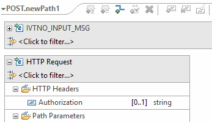

This shows fields that are exposed through the API and made available to the REST clients. By default, it is a one-to-one mapping to the fields that are exposed by the service unless you change the mapping.

3.  Right-click the `IN_COMMAND` field on right side of the tab, in the service definition, then click Add Assign transform.
4.  In the Properties view, at the bottom of the window, click General and set Value to <kbd class="ph userinput">ADD</kbd>.

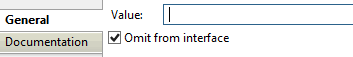

Leave the Omit from interface option checked to exclude this value from the API documentation.

Note: This mapping defines the flow of a value, which is passed in by an API consumer, to the service associated with the API. The service then passes the value to the IMS program. At each stage, the data is transformed into formats and structures that each participant can understand.

5.  Click File > Save from the menu to save your progress.
6.  Close the request tab.

<section class="section postreq">The next step is to clean up the API response by removing fields that are not related to the API request.</section>

### Mapping the response 

Remove irrelevant values from the response so that your API returns relevant fields only.

The API you're creating is designed to pass back information about a requested item in the phone book program. However, the `contacts` service contain several fields that aren’t relevant to that request.

You can safely remove these fields to make the API response and the API documentation clearer.

1.  Click Mapping... for the POST method, then click Open Response Mapping.
2.  Right-click `OUT_COMMAND`, and select Add Remove transform.

This excludes this field from the body of the response.  
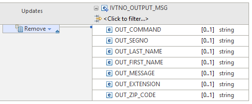  

3.  Click File > Save from the menu to save your progress.
4.  Close the response tab.

<section class="section result">You completed the request and response mappings.</section>

<section class="section postreq">You completed your API front end, your service association, and respective API-to-service mappings, so go ahead and make this API available.</section>

### Deploying the API 

Package and deploy your API from within the API Editor.

<section class="section context">Deploying your API is a quick, simple process that you can complete without leaving the developer environment.</section>

1.  In the Project Explorer view, select your API project (phonebook) and right-click to select z/OS Connect EE > Deploy API to z/OS Connect EE Server.
2.  Click OK.

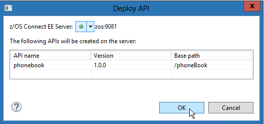Your API is being deployed.

3.  When deployment completes, click OK on the Result dialog box.

    
Your API is now successfully deployed!

<section class="section result">Creating and deploying this API using z/OS Connect EE gives your API consumers an easy, programmable way to interact with a IMS™application without having to work with unfamiliar data structures, or understand IMS.</section>

<section class="section postreq">You can test your work now, by calling the API from within the development environment by using the built-in interactive API documentation.</section>

### Testing the API 

Test your API by using the built-in Swagger UI.

<section class="section context">The OpenAPI (previously Swagger) specification is one of the most popular frameworks for documenting APIs. Any API that you create by using the z/OS Connect EE API Editor is automatically OpenAPI 2.0 compliant.

You can use the built-in Swagger UI to test out an API from within the developer environment. Let's try that now by opening up the Swagger UI for your new API, and adding a contact to the phone book.

</section>

1.  In the z/OS Connect EE Servers view, expand the API folder, right-click your API, and click Open in Swagger UI.

    
The Swagger UI for your API opens.

2.  In the tab that opens, click default, and then /contacts

    
Take a look at the Example Value JSON. You'll notice that the fields that you removed as part of the mapping are not present.

The IMS program that you have exposed by creating this API contains contact information.

You can use your new API to add a new contact.

1.  Click the Example Value box to copy the request message format into your phone book POST request.

    
Specify some values for the last name, first name, zip code, and extension.

2.  Click Try it out!.

    Information about the request URL, request headers, response body, response code, and response headers are provided. The response body contains the output message. The `OUT_MESSAGE` would contain one of the following messages:

    *   ENTRY WAS ADDED
    *   ADDITION OF ENTRY HAS FAILED (this message indicates that the IN_LAST_NAME value you specified already exists)

Congratulations! You've successfully exposed a IMS™ program as a RESTful API by using z/OS Connect EE!

