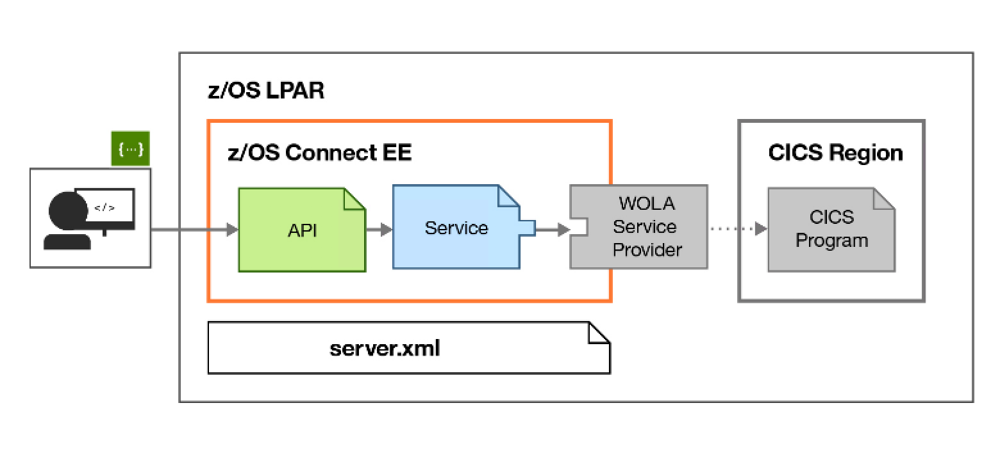

# Create RESTful APIs from traditional z/OS based assets using z/OS Connect

In this code we show how to create efficient and scalable RESTful APIs for mobile and cloud applications securely from your business critical applications residing on the mainframe.

IBM z/OS Connect Enterprise Edition provides access to z/OS subsystems, such as CICS®, IMS™, WebSphere® MQ, DB2®, and Batch, that use RESTful APIs with JSON formatted messages. The framework provides concurrent access, through a common interface, to multiple z/OS subsystems.

z/OS Connect EE can help to deliver benefits for an enterprise in two ways.
* It provides an intuitive workstation-based tool, the z/OS Connect EE API Editor, that enables a developer, with or without z/OS skills, to create RESTful APIs from traditional z/OS based assets. The core business assets that run on z/OS can easily be adapted to the latest mobile and cloud communication techniques and message protocol formats.
* Mobile and cloud application developers, inside or outside the enterprise, can incorporate z/OS data and transactions into their applications without the need to understand z/OS subsystems. The z/OS resources appear as any other RESTful API. 

## Scenarios

In this journey we will show how to use z/OS Connect EE to create, deploy, and test RESTful APIs that expose z/OS subsystems

### Scenario One: Expose a CICS COBOL program as a RESTful API.
### Scenario Two: Expose an IMS application as a RESTful API.

 

## Included components

[IBM® z/OS® Connect Enterprise Edition](https://www.ibm.com/us-en/marketplace/connect-enterprise-edition)    
[IBM® CICS®](https://www-01.ibm.com/software/data/enterprise-application-servers/cics/)    
[IBM® IMS®](https://www-01.ibm.com/software/data/db2imstools/products/ims-tools.html)    

## Prerequisites

To request a trial, go to [IBM Trial homepage](https://www-03.ibm.com/systems/z/resources/trials.html). On this page, navigate to the **z/OS Connect Enterprise Edition** panel on the right. In the panel, click **"register now"** button and follow the steps. If everything goes through, you shoud see a screen titled "Congradulations, your environment is on its way".
Wait for an email notification from "zTrial".
The waiting normally lasts several hours to one business day.   
The trial is available through a Windows-based remote desktop environment.

In order to access the trial environment, you must be able to connect to a remote system over a network connection.
Windows users should use the built-in Remote Desktop Connection application.       
Mac users should use the Remote Desktop app, available from the App Store.       
Linux users have several choices of remote desktop application, which might vary between distribution.   

## Steps

Your trial environment includes hands-on tutorials that explain how to:

* **Expose a CICS COBOL program as a RESTful API.**
* **Expose an IMS application as a RESTful API.**   

If you are to expose an API from scatch, normally you would need to install z/OS Connect EE API Editor and generate the Service Archive File(.sar) from your backend service first.   
The trials have taken care of those steps. So the focus is really on how to map the API and deploy them.   

The steps involved in both trials are:
* **Creating an API Project**
* **Importin the service SAR files**
* **Modeling API: adding paths and creating methods**
* **Defining HTTP-to-JSON Mappings: map arameters with the fields in the JSON schema**
* **Deploy your API**
* **Try out the api**

After you complete these tutorials, you can choose to extend them, or you can explore the rest of the trial environment. The choice is yours.   

## How long is the trial?

Your trial environment will expire three days after it is provisioned. At the end of the trial period, your environment will be automatically deprovisioned and all account and system data will be deleted.

## How do I access the trial?
    
The email from zTrial has more detailed information on your account. It provides the ip and credentials to access the remote desktop. Simply follow the instrutions and start the remote desktop.

Click on the following video to get more details on how to conduct the trial.

